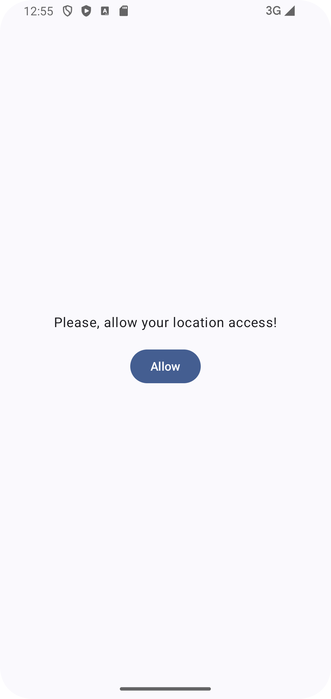

# LocationUpdatesCallbackFlowSample
## An Android App Sample of how to use CallbackFlow in compose

* Compose
* Kotlin Flow API
* CallbackFlow
* Hilt
* Accompanist Permissions in Compose (Manifest.permission.ACCESS_FINE_LOCATION)
* Version Catalogs dependencies (libs.versions.toml)

### References:
* https://medium.com/@manuaravindpta/callbackflow-in-kotlin-b830a1498946
* https://amitshekhar.me/blog/callback-to-flow-api-in-kotlin
* https://medium.com/@dheerubhadoria/mastering-location-permissions-and-ui-in-jetpack-compose-847cacd4be2e
* https://developer.android.com/build/migrate-to-catalogs
* https://developer.android.com/training/dependency-injection/hilt-android